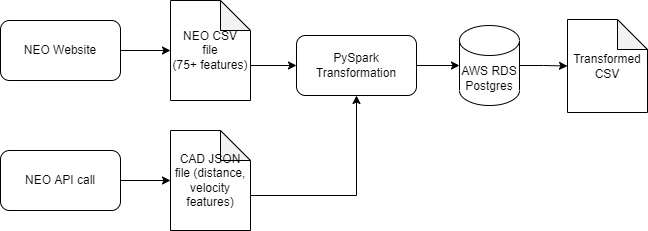

# NEOs_Project

Near Earth Objects Project

## Entity Relationship Diagram (ERD)


### NEO Data Points

| Field Name     | Type    | Description                                                                                                                                                                                                   |
|----------------|---------|---------------------------------------------------------------------------------------------------------------------------------------------------------------------------------------------------------------|
| spkid          | string  | primary SPK-ID                                                                                                                                                                                                |
| full_name      | string  | full designation (and name)                                                                                                                                                                                   |
| kind           | string  | indicates whether asteroid (a) or comet (c) and whether numbered (n) or unnumbered (u); for example a value of an indicates a numbered asteroid and cu indicates an unnumbered comet                          |
| pdes           | string  | primary designation (for numbered asteroids, this is the IAU number); examples: 433, 2016 B1, 1999 AN10                                                                                                       |
| name           | string  | IAU name (if any); examples: Ceres, Halley, d'Arrest                                                                                                                                                          |
| prefix         | string  | comet prefix: P, C, D (A for asteroids previously designated as comets)                                                                                                                                       |
| class          | string  | orbit classification code                                                                                                                                                                                     |
| neo            | boolean | flag indicating the object is an NEO (Y or N)                                                                                                                                                                 |
| pha            | boolean | flag indicating the object is a PHA (Potentially Hazardous) (Y or N)                                                                                                                                                                  |
| t_jup          | number  | Jupiter Tisserand parameter                                                                                                                                                                                   |
| moid           | number  | minimum distance between the orbits of Earth and the small-body (au); use moid.ld for units in lunar distances (LD)                                                                                           |
| moid_jup       | number  | minimum distance between the orbits of Jupiter and the small-body (au)                                                                                                                                        |
| orbit_id       | string  | orbit solution ID                                                                                                                                                                                             |
| epoch          | number  | epoch of osculation in Julian day form (TDB); use epoch.mjd for modified Julian day form; use epoch.cal for calendar form YYYY-MM-DD.D                                                                        |
| equinox        | string  | equinox of reference frame (e.g., J2000)                                                                                                                                                                      |
| e              | number  | eccentricity                                                                                                                                                                                                  |
| a              | number  | semimajor axis (au)                                                                                                                                                                                           |
| q              | number  | perihelion distance (au)                                                                                                                                                                                      |
| i              | number  | inclination (deg)                                                                                                                                                                                             |
| om             | number  | longitude of the ascending node (deg)                                                                                                                                                                         |
| w              | number  | argument of perihelion (deg)                                                                                                                                                                                  |
| ma             | number  | mean anomaly (deg)                                                                                                                                                                                            |
| tp             | number  | time of perihelion passage in Julian day form (TDB); use tp.cal for calendar form YYYY-MM-DD.D                                                                                                                |
| per            | number  | orbital period (d); use per.y for orbital period in Julian years (y)                                                                                                                                          |
| n              | number  | mean motion (deg/d)                                                                                                                                                                                           |
| ad             | number  | aphelion distance (au)                                                                                                                                                                                        |
| sigma_e        | number  | 1-sigma uncertainty in the eccentricity                                                                                                                                                                       |
| sigma_a        | number  | 1-sigma uncertainty in the semimajor axis (au)                                                                                                                                                                |
| sigma_q        | number  | 1-sigma uncertainty in the perihelion distance (au)                                                                                                                                                           |
| sigma_i        | number  | 1-sigma uncertainty in the inclination (deg)                                                                                                                                                                  |
| sigma_om       | number  | 1-sigma uncertainty in the longitude of the ascending node (deg)                                                                                                                                              |
| sigma_w        | number  | 1-sigma uncertainty in the argument of perihelion (deg)                                                                                                                                                       |
| sigma_tp       | number  | 1-sigma uncertainty in the time of perihelion passage (d)                                                                                                                                                     |
| sigma_ma       | number  | 1-sigma uncertainty in the mean anomaly (deg)                                                                                                                                                                 |
| sigma_per      | number  | 1-sigma uncertainty in the period (d)                                                                                                                                                                         |
| sigma_n        | number  | 1-sigma uncertainty in the mean motion (deg/d)                                                                                                                                                                |
| sigma_ad       | number  | 1-sigma uncertainty in the aphelion distance (au)                                                                                                                                                             |
| source         | string  | code indicating the source of the orbit: ORB=”JPL orbit file”, MPC:mpn=”MPC numbered asteroid orbit file”, MPC:mpu=”MPC unnumbered asteroid orbit file”, MPC:mp1=”MPC single opposition short-arc orbit file” |
| soln_date      | string  | date/time of orbit determination (YYYY-MM-DD hh:mm:ss, Pacific Local)                                                                                                                                         |
| producer       | string  | name of the person or institution responsible for the orbit determination                                                                                                                                     |
| data_arc       | number  | number of days spanned by the observations used in the orbit determination                                                                                                                                    |
| first_obs      | string  | date of the first observation used in the orbit (YYYY-MM-DD or YYYY-??-?? when only the year is known)                                                                                                        |
| last_obs       | string  | date of the last observation used in the orbit (YYYY-MM-DD or YYYY-??-?? when only the year is known)                                                                                                         |
| n_obs_used     | number  | total number of observations of all types used in the orbit                                                                                                                                                   |
| n_del_obs_used | number  | number of radar delay observations used in the orbit                                                                                                                                                          |
| n_dop_obs_used | number  | number of radar Doppler observations used in the orbit                                                                                                                                                        |
| two_body       | string  | flag indicating a low-precision 2-body dynamic model was used in the OD                                                                                                                                       |
| pe_used        | string  | JPL internal ID of the planetary ephemeris used in the OD                                                                                                                                                     |
| sb_used        | string  | JPL internal ID of the small-body ephemeris used in the OD                                                                                                                                                    |
| condition_code | string  | MPC “U” parameter: orbit uncertainty estimate 0-9, with 0 being good, and 9 being highly uncertain                                                                                                            |
| rms            | number  | normalized RMS of the observation fit in the OD                                                                                                                                                               |
| A1             | number  | non-grav. radial parameter                                                                                                                                                                                    |
| A2             | number  | non-grav. transverse parameter                                                                                                                                                                                |
| A3             | number  | non-grav. normal parameter                                                                                                                                                                                    |
| DT             | number  | non-grav. peri.-maximum offset (d)                                                                                                                                                                           |
| H              | number  | absolute magnitude (magnitude at 1 au from the Sun and the observer)                                                                                                                                          |
| G              | number  | magnitude slope parameter used in the standard asteroid H/G magnitude law                                                                                                                                     |
| M1             | number  | comet total magnitude parameter                                                                                                                                                                               |
| K1             | number  | comet total magnitude slope parameter                                                                                                                                                                        |
| M2             | number  | comet total magnitude parameter                                                                                                                                                                            |
| K2             | number  | comet nuclear magnitude parameter                                                                                                                                                                                                           |
| PC             | number  | comet nuclear magnitude law - phase coefficient                                                                               |
| H_sigma        | number  | 1-sigma uncertainty in absolute magnitude H                                                                                                                                                                      |
| diameter       | number  | effective body diameter (km)                                                                                                                                                                                  |
| extent         | string  | tri(or bi)-axial body dimensions (km)                                                                                                                                                                         |
| GM             | number  | mass expressed as a product of the mass “M” and gravitational constant “G” (km3/s2)                                                                                                                           |
| density        | number  | bulk density (g/cm3)                                                                                                                                                                                          |
| rot_per        | number  | body rotation period (synodic) (h)                                                                                                                                                                            |
| pole           | string  | spin-pole direction in R.A./Dec. (deg)                                                                                                                                                                        |
| albedo         | number  | geometric albedo                                                                                                                                                                                              |
| BV             | number  | color index B-V                                                                                                                                                                                               |
| UB             | number  | color index U-B                                                                                                                                                                                               |
| IR             | number  | color index I-R                                                                                                                                                                                               |
| spec_T         | string  | Tholen spectral taxonomic classification                                                                                                                                                                      |
| spec_B         | string  | SMASSII spectral taxonomic classification                                                                                                                                                                     |
| diameter_sigma | number  | 1-sigma formal (or estimated) uncertainty in diameter                                                                                                                                                        |

### Close Approaches Data Points

| Field Name | Type      | Description                                                          |
|------------|-----------|----------------------------------------------------------------------|
| des        | string    | primary designation of the asteroid or comet (e.g.                   |
| orbit_id   | string    | orbit ID                                                             |
| jd         | string    | time of close-approach (JD Ephemeris Time)                           |
| cd         | timestamp | time of close-approach (formatted calendar date/time                 |
| dist       | number    | nominal approach distance (au)                                       |
| dist_min   | number    | minimum (3-sigma) approach distance (au)                             |
| dist_max   | number    | maximum (3-sigma) approach distance (au)                             |
| v_rel      | number    | velocity relative to the approach body at close approach (km/s)      |
| v_inf      | number    | velocity relative to a massless body (km/s)                          |
| t_sigma_f  | number    | 3-sigma uncertainty in the time of close-approach (formatted in days |
| h          | number    | absolute magnitude H (mag)                                           |

## Sample Neo Data
```
"spkid","full_name","pdes","name","prefix","neo","pha","H","G","M1","M2","K1","K2","PC","diameter","extent","albedo","rot_per","GM","BV","UB","IR","spec_B","spec_T","H_sigma","diameter_sigma","orbit_id","epoch","epoch.mjd","epoch.cal","equinox","e","a","q","i","om","w","ma","ad","n","tp","tp.cal","per","per.y","moid","moid.ld","moid_jup","t_jup","sigma_e","sigma_a","sigma_q","sigma_i","sigma_om","sigma_w","sigma_ma","sigma_ad","sigma_n","sigma_tp","sigma_per","class","producer","data_arc","first_obs","last_obs","n_obs_used","n_del_obs_used","n_dop_obs_used","condition_code","rms","two_body","A1","A2","A3","DT"
2000433,"   433 Eros (A898 PA)",433,Eros,,Y,N,10.43,0.46,,,,,,16.84,34.4x11.2x11.2,0.25,5.27,4.463e-04,0.921,0.531,,S,S,,0.06,"JPL 659",2459600.5,59600,2022-01-21.0,J2000,0.2227,1.458,1.133,10.83,304.30,178.90,246.90,1.78,0.5597,2459802.57,2022-08-11.1,643,1.76,0.149,58,3.29,4.58,9.4e-09,1.6e-10,1.4e-08,1.2e-06,3.6e-06,4.0e-06,1.4e-06,1.9e-10,9.1e-11,2.6e-06,1.0e-07,AMO,Giorgini,46582,1893-10-29,2021-05-13,9130,4,2,0,.29796,,,,,
2000719,"   719 Albert (A911 TB)",719,Albert,,Y,N,15.51,,,,,,,,,,5.801,,,,,S,,,,"JPL 221",2459600.5,59600,2022-01-21.0,J2000,0.5470,2.638,1.195,11.58,183.86,156.23,278.20,4.08,0.2301,2459956.01,2023-01-11.5,1.56e+03,4.28,0.203,78.8,1.42,3.14,2.2e-08,2.5e-09,5.8e-08,2.9e-06,1.6e-05,1.6e-05,2.7e-06,3.9e-09,3.3e-10,1.2e-05,2.3e-06,AMO,"Otto Matic",40008,1911-10-04,2021-04-17,1894,,,0,.39775,,,,,
2000887,"   887 Alinda (A918 AA)",887,Alinda,,Y,N,13.87,-0.12,,,,,,4.2,,0.31,28.41,,0.832,0.436,,,S,,,"JPL 428",2459600.5,59600,2022-01-21.0,J2000,0.5705,2.473,1.062,9.39,110.43,350.49,86.61,3.88,0.2534,2459258.73,2021-02-13.2,1.42e+03,3.89,0.0815,31.7,1.32,3.22,2.7e-08,3.0e-09,6.7e-08,3.1e-06,2.3e-05,2.4e-05,3.6e-06,4.7e-09,4.6e-10,1.4e-05,2.6e-06,AMO,"Otto Matic",37799,1918-02-03,2021-07-31,2624,,,0,.39776,,,,,
2001036,"  1036 Ganymed (A924 UB)",1036,Ganymed,,Y,N,9.25,0.30,,,,,,37.675,,0.238,10.297,,0.842,0.417,,S,S,,0.40,"JPL 949",2459600.5,59600,2022-01-21.0,J2000,0.5331,2.666,1.245,26.68,215.52,132.43,140.65,4.09,0.2264,2458979.34,2020-05-09.8,1.59e+03,4.35,0.345,134,1.95,3.03,1.1e-08,1.9e-09,3.0e-08,4.9e-07,1.1e-06,1.2e-06,1.5e-06,2.9e-09,2.4e-10,6.2e-06,1.7e-06,AMO,"Otto Matic",35482,1924-10-23,2021-12-15,7159,0,1,0,.37075,,,,,
2001221,"  1221 Amor (1932 EA1)",1221,Amor,,Y,N,17.39,,,,,,,1.0,,,,,,,,,,,,"JPL 110",2459600.5,59600,2022-01-21.0,J2000,0.4358,1.919,1.082,11.88,171.32,26.64,261.04,2.75,0.3708,2459867.34,2022-10-14.8,971,2.66,0.106,41.4,2.21,3.78,3.3e-08,9.2e-10,6.3e-08,4.4e-06,2.1e-05,2.2e-05,7.7e-06,1.3e-09,2.7e-10,2.1e-05,7.0e-07,AMO,"Otto Matic",32775,1932-03-12,2021-12-05,573,,,0,.45902,,,,,
2001566,"  1566 Icarus (1949 MA)",1566,Icarus,,Y,Y,16.35,,,,,,,1.0,,0.51,2.2726,,0.774,0.520,,,,,,"JPL 126",2459600.5,59600,2022-01-21.0,J2000,0.8269,1.078,0.187,22.80,87.96,31.44,0.33,1.97,0.8805,2459600.12,2022-01-20.6,409,1.12,0.0342,13.3,3.22,5.3,2.8e-08,2.9e-09,3.0e-08,8.8e-06,3.5e-06,5.4e-06,8.0e-06,5.3e-09,3.6e-09,9.1e-06,1.7e-06,APO,"Otto Matic",26339,1949-07-01,2021-08-11,1078,10,13,0,.34741,,,-3.1e-15,,
```

## Sample Cad Data

Close-approach data for asteroid 433 Eros within 0.2 au between 1900-Jan-01 and 2100-Jan-01:

**HTTP Request:**
```
https://ssd-api.jpl.nasa.gov/cad.api?des=433&date-min=1900-01-01&date-max=2100-01-01&dist-max=0.2
```
**Results:**
```
{
"signature": {
"source": "NASA/JPL SBDB Close Approach Data API",
"version": "1.4"
},
"count": "5",
"fields": [
"des",
"orbit_id",
"jd",
"cd",
"dist",
"dist_min",
"dist_max",
"v_rel",
"v_inf",
"t_sigma_f",
"h"
],
"data": [
[
"433",
"659",
"2426371.671249267",
"1931-Jan-30 04:07",
"0.174073145828143",
"0.174073021249871",
"0.174073270408642",
"5.92081853410288",
"5.91823274159338",
"< 00:01",
"10.43"
],
[
"433",
"659",
"2442435.819062972",
"1975-Jan-23 07:39",
"0.151134190879819",
"0.151134141782744",
"0.151134239976902",
"5.82530768329976",
"5.82228046582781",
"< 00:01",
"10.43"
],
[
"433",
"659",
"2455957.958753891",
"2012-Jan-31 11:01",
"0.17867581359062",
"0.178675792496712",
"0.178675834684529",
"5.9451959020589",
"5.94268706727029",
"< 00:01",
"10.43"
],
[
"433",
"659",
"2472021.960376792",
"2056-Jan-24 11:03",
"0.149782176486572",
"0.149782128520116",
"0.149782224453053",
"5.8207578574117",
"5.8177009186216",
"< 00:01",
"10.43"
],
[
"433",
"659",
"2485544.157501873",
"2093-Jan-31 15:47",
"0.182463884248595",
"0.182463741490261",
"0.18246402700921",
"5.97491362207991",
"5.97246910733982",
"< 00:01",
"10.43"
]
]
}
```

## ETL Process


## References

<a href="https://ssd-api.jpl.nasa.gov/doc/sbdb_query.html" target="_blank">Small Object Database Query (NASA)</a>

<a href="https://ssd-api.jpl.nasa.gov/doc/cad.html" target="_blank">SBDB Close Approach Data API (NASA)</a>


