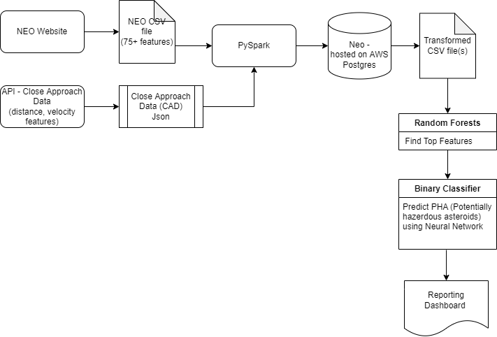
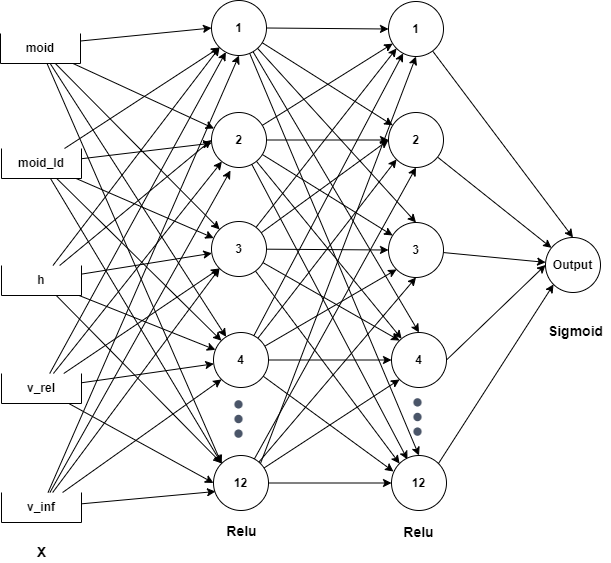
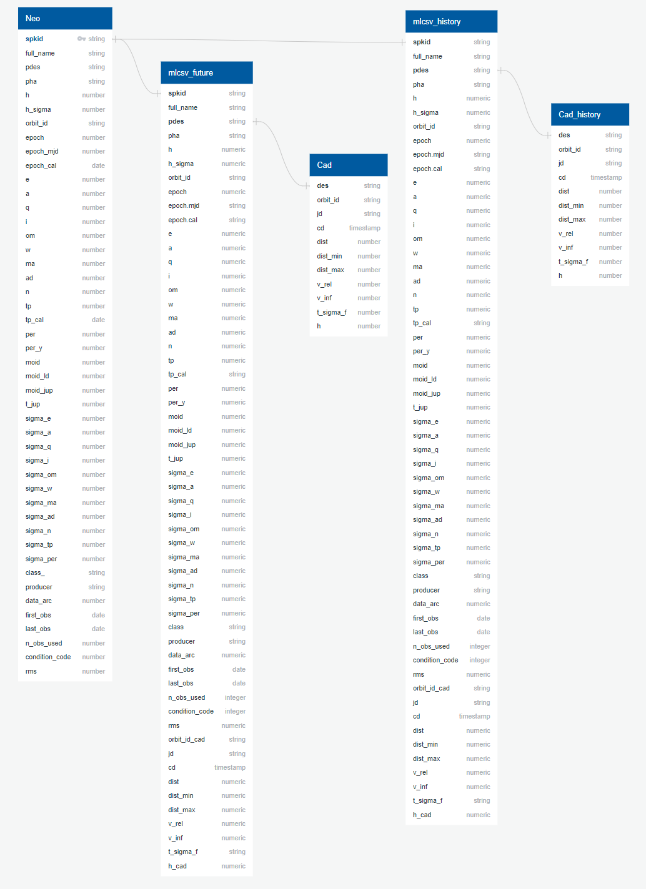

# NEOs Project
UC Berkeley Data Analytics Bootcamp Final Project

<a href= "https://docs.google.com/presentation/d/1BQlw8KsA-17b0CTgA-Jki0ccUJvn-29yCgjgTW-MsKI/edit?usp=sharing*" target="_blank"> NEOs Google Slide</a> 

## Group Members:
|       Member       |      Role      |                   Responsibilities                  |
|--------------------|----------------|-----------------------------------------------------|
|Jacqueline Tsodikova|   Technology   |     Will decide which technologies will be used     |
|  Alejandra Magana  |     Github     |          Responsible for Github repository          |
|   Michael Albers   |    Database    |Create mockup of a database with a set of sample data|
|    Robert Janke    |Machine Learning|      Manage the Machine Learning Model & Design     |
|     Fred Jambor    |Machine Learning|      Manage the Machine Learning Model & Design     |

## Introduction 

Near-Earth Objects (NEOs) are comets and asteroids that have been nudged by the gravitational attraction of nearby planets into orbits that allow them to enter the Earth’s neighborhood. Composed mostly of water ice with embedded dust particles, comets originally formed in the cold outer planetary system while most of the rocky asteroids formed in the warmer inner solar system between the orbits of Mars and Jupiter. The scientific interest in comets and asteroids is due largely to their status as the relatively unchanged remnant debris from the solar system formation process some 4.6 billion years ago. The giant outer planets (Jupiter, Saturn, Uranus, and Neptune) formed from an agglomeration of billions of comets and the left over bits and pieces from this formation process are the comets we see today. Likewise, today’s asteroids are the bits and pieces left over from the initial agglomeration of the inner planets that include Mercury, Venus, Earth, and Mars.

As the primitive, leftover building blocks of the solar system formation process, comets and asteroids offer clues to the chemical mixture from which the planets formed some 4.6 billion years ago. If we wish to know the composition of the primordial mixture from which the planets formed, then we must determine the chemical constituents of the leftover debris from this formation process - the comets and asteroids.

## Why this topic?

Our group chose this topic because we wanted to build a binary classifier model which can predict future NEOs as either potentially hazardous to Earth or not. A new movie on Netflix, *Don't Look Up*, was just released that had to do with a comet approaching Earth and scientists trying to warn the public about it. Although this movie is more about comedic humor, a comet or asteroid harming our planet is definitely something that could happen. So, we wanted to research and analyze the data to see how likely a NEO could harm us. 

## Questions We Would Like to Answer:

1. Which NEOs will be the closest approach? 
2. Can we predict potentially hazardous objects in the future?
3. Which NEOs are the most potentially hazardous?

## Outline of the Project:
- Used PostgreSQL to store our data and created five main tables to build and perform the machine learning model using the primary designation as the main key
- Crated our ETL process for extracting NEOs and Close Approaches, which included transforming and loading the data into an AWS RDS database 
- Prepared our dataset by cleaning up and dropping any columns that were not significant to our project
- Conducted Random-Over-Sampler, SMOTE, Random Forest, Over and Under Sampling and SMOTEENN tests to populate NEOS that are potentially hazardous to Earth as accurate as possible
- Created Google Slides and Tablaeu dashboard to provide a visually appealing and interactive presentation to our audience

## Technologies Used

Which tools are the best fit for your project? 

We have chosen the following: 
- PostgreSQL to store large and sophisticated data safely
- PySpark to have a wide range of libraries and use it for Machine Learning Analysis to provide simple and comprehensive API
- CSV files to read data and then to import into a spreadsheet or another storage database
- Tableau to create a dashboard and story for presenting our analysis 
- Entity Relationship Diagram (ERD) to model the data stored in our database
- Random Forest Classifier to test our Machine Learning
- Pandas for cleaning the data 
- A public AWS RDS database to store our data

### Dashboard Overview

<a href= "https://public.tableau.com/views/NEOsProject/NEOsProject?:language=en-US&publish=yes&:display_count=n&:origin=viz_share_link" target="_blank">Tableau Story</a> 

We will be using Tablaeu to create our final dashboard because it is visually appealing and it is interactive for the viewers. We will be creating a story within Tablaeu so that the users can click through different section titles to see an array of data. The data we have created are the following: 

- A pie chart of which class each predicted PHA is apart of
- First Observations the asteroids were made by each year 
- Last Observations the asteroids were made by each year 
- Condition Code (9 being very confident in our predictions and 0 being very not confident in our predictions)
- Distance per Each NEO
- Velocity per Each NEO
- Magnitude per Each NEO

The interactive elements will be within the Distance, Velocity, and Magnitude per Each NEO tabs. The viewer will be able to toggle over the range of values to show the least and the most distance, velocity, or magnitude. The viewer will also be able to press on the drop down menu that has a list of every name to choose a specific NEO. 

### Database Overview
For our database, we have used pgAdmin within PostgreSQL to see the connections between the different datasets. The varaible we are looking for is PDES (primary designation for numbered asteroids). For our dashboard, we will be using Tableau to create a story of our data. 

### Machine Learning Overview
SciKitLearn is the ML library we'll be using to create a classifier. We used the following:  
- Random Forest Classifier because it provides higher accuracy through cross validation. Random forest classifier will handle the missing values and maintain the accuracy of a large proportion of data. Our data sets are 92% accurate 
- RandomOverSampler involves randomly duplicating examples from the minority class and adding them to the training dataset. This technique can be effective for those machine learning algorithms that are affected by a skewed distribution and where multiple duplicate examples for a given class can influence the fit of the model
- SMOTE(synthetic minority oversampling technique) is one of the most commonly used oversampling methods to solve the imbalance problem. It aims to balance class distribution by randomly increasing minority class examples by replicating them
- For our final predictions we used a Neural Network method because it provided us the most accurate results at 99.8%. However, true negatives make up a lot of that percentage, so our confidence matrix will show that most of the predictions were correct.

## Descriptions of our Data
For our data and machine learning, we had one person working on our database and two people working on different sets of machine learning. For the database, we used ERD and Postgres to store and analyze our data. For the machine learning, both people analyzed NEOs that were potentially hazardous to Earth, but they used different methods. The first person used the Random Forest Classifier, which had 92% accuracy, and over/under sampling to test the accuracy of the data set. The second person used RandomOverSampler and SMOTE and found that these model fail to have an accurate prediction of hazardous object. It is always good to test different models on our machine learning to see if any data is skewed or give more accurate results.

## Database

[Here is the link to our NEO Data Points Glossary](https://github.com/AleeAlette1/NEOs_Project/blob/main/Database/Data_Points_Glossary/CloseApproachesREADME.md)

[Here is the link to our Close Approaches Data Points Glossary](https://github.com/AleeAlette1/NEOs_Project/blob/main/Database/Data_Points_Glossary/DataPointREADME.md)

[Here is the link to our SQL Scripts](https://github.com/AleeAlette1/NEOs_Project/tree/main/Database/sql)

### Entity Relationship Diagram (ERD)
For our database, since we had over 28,000 rows, we decided to use PostgreSQL because it stores large and sophisticated data safely and we could visually see the relationships between our data. The image below represents the tables of data that we uploaded onto the database. We used five main tables with the data to build and perform the machine learning model with the primary designation being the most common connection between all of our datasets:

### Database Tables

| Table Name    | Source Data                                                                                        |
|---------------|----------------------------------------------------------------------------------------------------|
| Neo           | CSV file downloaded from NASA website                                                              |
| Cad           | API call to NASA website to pull current and future close approaches data up to year 2100          |
| Cad_history   | API call to NASA website to pull historical close approaches data dating back to year 1900         |
| mlcsv_future  | Join query from most recent close approach in CAD table with Neo table. See **join_query_future.sql**  |
| mlcsv_history | Join query from most recent close approach in CAD history table with Neo table. See **join_query.sql** |

                                                              
### ETL Process
A detailed description of the process of extracting Near Earth Objects and Close Approaches data, transformation and loading into an AWS RDS database. 

[Here is a link to a Detailed ETL Process](https://github.com/AleeAlette1/NEOs_Project/blob/main/Database/README/Detail_ETL_Process.md)

## Machine Learning
### Pre-Processing of the Dataset:
For the first segment of our project, we randomly selected a csv file with 28,052 rows and 36 columns. We initially dropped string columns containing names and IDs for these objects ("full_name and "orbit_ID" columns). Then we went ahead and dropped ['equinox', 'PC'] columns "epoch.cal" column includes epoch of osculation in calendar for each row. In astronomy, an epoch or reference epoch is a moment in time used as a reference point for some time-varying astronomical quantity. We decided to drop this column momentarily since it has no impact on our analysis. We then proceeded with eliminating the columns that had null values more than 50 percent of the total number of rows and then replaced the other null values with zero. The Potentially Hazardous Asteroids (PHA) column had string values of yes and no, which indicates whether it is a hazardous object.

- Dropped all NAN for the Potentially Hazardous Asteroids and converted Y/N to 1 or 0
- Created 3 different datasets to run through a random forest. Noticed that set 1 had a lot of NANs in regards to size of asteroid, so we will not use that set in ML model

### Performing Resampling Supervised Machine Learning
For this segment of the project, we used Random-Over-Sampler and SMOTE python libraries for our machine learning classification models. The target variable is column "PHA" which stands for Potentially Hazardous Asteroids. A value check on our target variable showed   25,839 0s and 2,213 1s which indicates the imbalance between the number of hazardous vs non-hazardous objects.

Below is the list of feature variables "X" for our model

Both Random-Over-Sampler and SMOTE models generated roughly 69% accuracy in their prediction.
SMOTE resulted in a precision of 95% for "0" and 23% for "1", meaning our model is able to predict the non hazardous objects for 95% of the time and is only able to predict the hazardous objects 23% of the time. 
Since our model fails to have an accurate prediction of hazardous object, we will look for further improvements in our data set and also trying different machine learning techniques

### Random Forest for 2 of the Mockup Data Sets
As stated, only used DS2 and DS3 as DS1 which had too many NAN values. Both datasets showed to be good models with the Random Forest Classifier, with around 92% accuracy. However, we noticed in DS2 that the precision for an impact was low, indicating that we are getting a lot of false negatives. This is concerning if we are looking for impacts because we might miss them. A big problem could be that we have many more negative PHA outcomes than positive. Hence, I will try oversampling or undersampling to see if that helps. 

### Over and Under Sampling for DS2
Over and under sampling worked better because they identified more true positives. It is a bit concerning that there are still many false negatives, almost 40% of actual impacts were classified wrong in the oversampling (228 predicted wrong, 325 predicted correctly) and similar results for the undersampling. The main change here is a drop in accuracy in that we have more false positives - predicted impacts that are not actual impacts.

### One Last Test with SMOTEENN
This method seemed to work much better. However, accuracy is still not great, mostly due to false positives, which is better than a false negative when dealing with asteroid impacts. We still have a high rate of false negatives, with our recall at 0.75, or about 25% of the actual impacts are predicted to be misses. Need to see if we can clean that up in a future model.

### Performing RandomForest Sampling on our merged DataFrame

We initially performed a RandomForestSampling on our data using these variables:

['h', 'e', 'a', 'q', 'i', 'om', 'w', 'ma', 'ad', 'n', 'per', 'per_y', 'moid', 'moid_ld', 'moid_jup', 't_jup', 'sigma_e', 'sigma_a', 'sigma_q', 'sigma_i', 'sigma_om', 'sigma_w', 'sigma_ma', 'sigma_ad', 'sigma_n', 'sigma_tp', 'sigma_per', 'data_arc', 'condition_code', 'rms', 'dist', 'dist_min', 'dist_max', 'v_rel', 'v_inf', 'h_cad', 'class_AMO', 'class_APO', 'class_ATE', 'class_ETc', 'class_HTC', 'class_IEO', 'class_JFC', 'class_JFc']

For more information about these variables please refer to the Glossary link below:

[NEO Data Points Glossary](https://github.com/AleeAlette1/NEOs_Project/blob/main/Database/Data_Points_Glossary/CloseApproachesREADME.md)

[Close Approaches Data Points Glossary](https://github.com/AleeAlette1/NEOs_Project/blob/main/Database/Data_Points_Glossary/DataPointREADME.md)

Our RandomForest Sampling revealed satisfactory results. Please see snippet below of confusion matrix for our RandomForest Sampling:

As indicated in the confusion matrix, after running 5,624 predictions on our data, there was a total of (7) false predictions on NEOs that were potentially hazardous but our model prediction was a non-hazardous object. This result is not satisfactory due to criticality of identifiying potential hazardous asteroids.

For more information on our Random Forest Machine Learning model, please refer to the link below:

[Random Forest Machine Learning Model](https://github.com/AleeAlette1/NEOs_Project/blob/main/Machine_Learning/ipynb/FJ_ML2_RandomForest.ipynb)

### Performing Neural Networks to Generate More Accurate Predictions
To improve the accuracy of our model, we sorted the features by their performance by calculating the feature importance using RandomForestSampling model. 

Our group decided to select the top 3 important features from snippet above in addition to velocity variables ("v_inf" & "v_rel") from CAD (Close Approaches Data) to build a Neural Networks model.
See snippet below for an overview of our model's properties

As illustrated in above snippet, we can see that our model consists of two hidden layers with total of 12 hidden nodes in each layer. We selected "Relu" activation function for each layer.
Please see below results of our neural networks model:

As displayed in above snippet, our neural network model is generating 99.54% accuracy. Accuracy represents the number of correctly classified data instances over the total number of data instances.

For more information on our Neural Networks Machine Learning model, please refer to the link below:

[Neural Networks Machine Learning Model](https://github.com/AleeAlette1/NEOs_Project/blob/main/Machine_Learning/ipynb/FJ_ML2_NN.ipynb)

### Using Neural Networks trained model to Generate Accurate Predictions

Using Pandas.read_csv, we imported a csv file that contains all future CAD (Close Approach Data) and NEOs (Near Earth Objects). This merged table is generated using PostgresSQL. 
See below snippet for list of imported dependencies.

We initially assessed the number of null values in our impirted data frame and used .dropna() to ommit rows containing any null value. We then created a list of feature_columns ["moid","moid_ld","h","v_rel","v_inf"] which are the same features used in our trained neural networks model to seperate these columns from our future data. 

As displayed below, our future_df has total of 11438 rows and 5 columns. 

We then used StandardScaler instance to scale out feature variables. We then imported our trained NN model ('NEOs_project_NN.h5') and started running predictions and normalizing the results. 

## Analysis Results

Based off of our analysis, we have determined there are 11,370 potentially hazardous Near-Earth-Objects. 
In the picture below, we can see the difference between our results and the original forecasted "pha."

#### Data Sources
<a href="https://ssd-api.jpl.nasa.gov/doc/sbdb_query.html" target="_blank">Small Object Database Query (NASA)</a>

<a href="https://ssd-api.jpl.nasa.gov/doc/cad.html" target="_blank">SBDB Close Approach Data API (NASA)</a>

<a href= "https://cneos.jpl.nasa.gov/about/basics.html" target="_blank"> NEOs Basics (NASA)</a>

### Research sources
https://www.wise-geek.com/what-factors-determine-the-damage-of-an-asteroid-impact.htm#:~:text=The%20most%20important%20factor%20determining,the%20square%20of%20its%20velocity.

