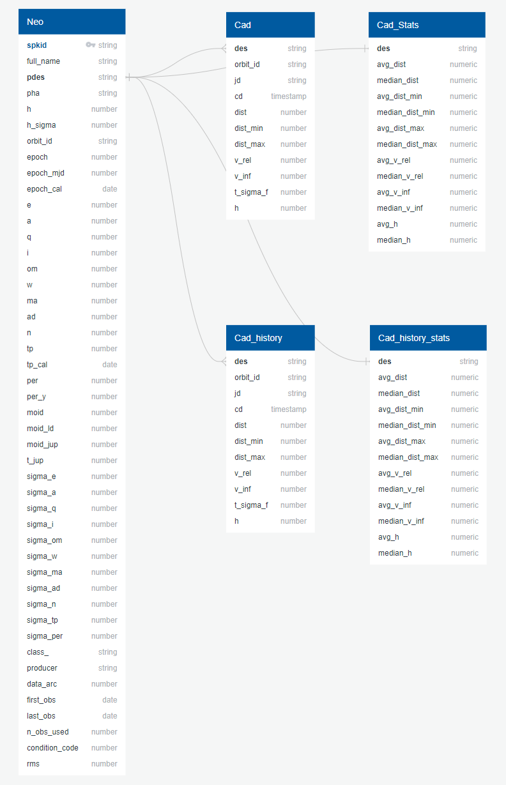
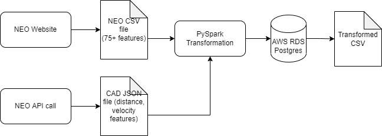

# NEOs Project
UC Berkeley Data Analytics Bootcamp Final Project

#### Introduction 

Near-Earth Objects (NEOs) are comets and asteroids that have been nudged by the gravitational attraction of nearby planets into orbits that allow them to enter the Earth’s neighborhood. Composed mostly of water ice with embedded dust particles, comets originally formed in the cold outer planetary system while most of the rocky asteroids formed in the warmer inner solar system between the orbits of Mars and Jupiter. The scientific interest in comets and asteroids is due largely to their status as the relatively unchanged remnant debris from the solar system formation process some 4.6 billion years ago. The giant outer planets (Jupiter, Saturn, Uranus, and Neptune) formed from an agglomeration of billions of comets and the left over bits and pieces from this formation process are the comets we see today. Likewise, today’s asteroids are the bits and pieces left over from the initial agglomeration of the inner planets that include Mercury, Venus, Earth, and Mars.

As the primitive, leftover building blocks of the solar system formation process, comets and asteroids offer clues to the chemical mixture from which the planets formed some 4.6 billion years ago. If we wish to know the composition of the primordial mixture from which the planets formed, then we must determine the chemical constituents of the leftover debris from this formation process - the comets and asteroids.

#### Why this topic?

Our group chose this topic because we wanted to build a binary classifier model which can predict future NEOs as either potentially hazardous to Earth or not. A new movie on Netflix, *Don't Look Up*, was just released that had to do with a comet approaching Earth and scientists trying to warn the public about it. Although this movie is more about the satire of different characters, a comet or asteroid harming our planet is definitely something that could happen. So, we wanted to research and analyze data to see how likely a NEO could harm us. 

#### Questions We Would Like to Answer:

1. Is there gonna be a space object that has the potential to hit our planet?
2. What is the probability that these objects will be hazardous?
3. Where is the primary designation for the asteroids?

#### Group Members:
|       Member       |      Role      |                   Responsibilities                  |
|--------------------|----------------|-----------------------------------------------------|
|Jacqueline Tsodikova|   Technology   |     Will decide which technologies will be used     |
|  Alejandra Magana  |     Github     |          Responsible for Github repository          |
|   Michael Albers   |    Database    |Create mockup of a database with a set of sample data|
|    Robert Janke    |Machine Learning|      Manage the Machine Learning Model & Design     |
|     Fred Jambor    |Machine Learning|      Manage the Machine Learning Model & Design     |

#### Communication Protocols
Our group communicated via zoom 3 different times this week and we all agreed on our roles and the deadline each person had to meet. Because our group is from all over the country, we found it easier to answer any questions or give updates using our Slack group channel. Everyone was able to do their work on time, so our communication protocols are working for our group.

#### Locations of Project Deliverables:
|           Objective          |    Location   |
|------------------------------|---------------|
|         Presentation         |       *       |
|         Analysis Code        |       *       |
|Machine Learning code & output|       *       |

## Database
#### Description 

For our data source and machine learning, we had one person working on our database and two people working on different sets of machine learning. For the database, we used ERD and Postgres to store and anlyze our data. For the machine learning, both people analyzed NEOs that were potentially hazardous to Earth, but they used different methods. The first person used the Random Forest Classifier, which had 92% accuracy, and over/under sampling to test the accuracy of the data set. The second person used RandomOverSampler and SMOTE and found that these model fail to have an accurate prediction of hazardous object. It is always good to test different models on our machine learning to see if any data is skewed or give more accurate results.

#### Entity Relationship Diagram (ERD)
For our database, since we had over 28,000 rows, we decided to use PostgreSQL because it stores large and sophisticated data safely and we could visually see the relationships between our data. The image below represents the tables of data that we uploaded onto the database. We used three main tables with the data to build and perform the machine learning model with the primary designation being the most common connect between all of our datasets:

#### ETL Process

##### Data Sources
<a href="https://ssd-api.jpl.nasa.gov/doc/sbdb_query.html" target="_blank">Small Object Database Query (NASA)</a>

<a href="https://ssd-api.jpl.nasa.gov/doc/cad.html" target="_blank">SBDB Close Approach Data API (NASA)</a>

<a href= "https://cneos.jpl.nasa.gov/about/basics.html" target="_blank">SBDB NEOs Basics (NASA)</a>

## Machine Learning

## Dashboard

## Analysis Results

