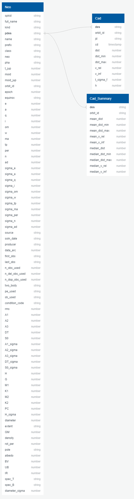
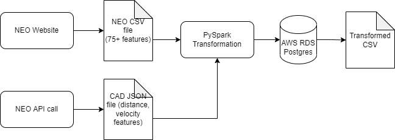

# NEOs Project
UC Berkeley Data Analytics Bootcamp Final Project

## Introduction 

Near-Earth Objects (NEOs) are comets and asteroids that have been nudged by the gravitational attraction of nearby planets into orbits that allow them to enter the Earth’s neighborhood. Composed mostly of water ice with embedded dust particles, comets originally formed in the cold outer planetary system while most of the rocky asteroids formed in the warmer inner solar system between the orbits of Mars and Jupiter. The scientific interest in comets and asteroids is due largely to their status as the relatively unchanged remnant debris from the solar system formation process some 4.6 billion years ago. The giant outer planets (Jupiter, Saturn, Uranus, and Neptune) formed from an agglomeration of billions of comets and the left over bits and pieces from this formation process are the comets we see today. Likewise, today’s asteroids are the bits and pieces left over from the initial agglomeration of the inner planets that include Mercury, Venus, Earth, and Mars.

As the primitive, leftover building blocks of the solar system formation process, comets and asteroids offer clues to the chemical mixture from which the planets formed some 4.6 billion years ago. If we wish to know the composition of the primordial mixture from which the planets formed, then we must determine the chemical constituents of the leftover debris from this formation process - the comets and asteroids.

## Why this topic?

Our group chose this topic because we wanted to build a binary classifier model which can predict future NEOs as either potentially hazardous to Earth or not. A new movie on Netflix, *Don't Look Up*, was just released that had to do with a comet approaching Earth and scientists trying to warn the public about it. Although this movie is more about comedic humor, a comet or asteroid harming our planet is definitely something that could happen. So, we wanted to research and analyze the data to see how likely a NEO could harm us. 

## Questions We Would Like to Answer:

1. Is there going to be a space object that has the potential to hit our planet?
2. What is the probability that these objects will be hazardous?
3. What is the name of the NEO(s) that are potentially hazardous?

## Outline of the Project:
- 

## Group Members:
|       Member       |      Role      |                   Responsibilities                  |
|--------------------|----------------|-----------------------------------------------------|
|Jacqueline Tsodikova|   Technology   |     Will decide which technologies will be used     |
|  Alejandra Magana  |     Github     |          Responsible for Github repository          |
|   Michael Albers   |    Database    |Create mockup of a database with a set of sample data|
|    Robert Janke    |Machine Learning|      Manage the Machine Learning Model & Design     |
|     Fred Jambor    |Machine Learning|      Manage the Machine Learning Model & Design     |

## Communication Protocols
- Segment 1: Our group communicated via zoom 3 different times this week and we all agreed on our roles and the deadline each person had to meet. Because our group is from all over the country, we found it easier to answer any questions or give updates using our Slack group channel. Everyone was able to do their work on time, so our communication protocols are working for our group.
- Segment 2: Our group communicated via zoom both during class times and outside of class times. We also continue to use our group slack channel for any qucik questions/comments. Even though we are allocated two weeks for segment 2, our group agreed to finish it within 1 week and start on segment 3 early so that we have enough time to work on the presentation aspect of our project. 

### Locations of Project Deliverables:
|           Objective          |    Location   |
|------------------------------|---------------|
|         Presentation         |       *       |
|         Analysis Code        |       *       |
|Machine Learning code & output|       *       |

## Technologies Used

Which tools are the best fit for your project? 

We have chosen the following: 
- PostgreSQL to store large and sophisticated data safely
- PySpark to have a wide range of libraries and use it for Machine Learning Analysis. It provides simple and comprehensive API.
- CSV files to read data and then to import into a spreadsheet or another storage database
- Tableau to create a dashboard and story for presenting our analysis 
- Entity Relationship Diagram (ERD) to model the data stored in our database
- Random Forest Classifier to test our Machine Learning
- Pandas for cleaning the data 

### Database 

For our databse, we have used pgAdmin within PostgreSQL to see the connections between the different datasets. The varaible we are looking for is PDES (primary designation for numbered asteroids). For our dashboard, we will be using Tableau to create a story of our data. 

### Machine Learning 

SciKitLearn is the ML library we'll be using to create a classifier. We used the following:  
- Random Forest Classifier because it provides higher accuracy through cross validation. Random forest classifier will handle the missing values and maintain the accuracy of a large proportion of data. Our data sets are 92% accurate. 
- RandomOverSampler involves randomly duplicating examples from the minority class and adding them to the training dataset. This technique can be effective for those machine learning algorithms that are affected by a skewed distribution and where multiple duplicate examples for a given class can influence the fit of the model
- SMOTE(synthetic minority oversampling technique) is one of the most commonly used oversampling methods to solve the imbalance problem. It aims to balance class distribution by randomly increasing minority class examples by replicating them

## Descriptions of our Data

For our data source and machine learning, we had one person working on our database and two people working on different sets of machine learning. For the database, we used ERD and Postgres to store and anlyze our data. For the machine learning, both people analyzed NEOs that were potentially hazardous to Earth, but they used different methods. The first person used the Random Forest Classifier, which had 92% accuracy, and over/under sampling to test the accuracy of the data set. The second person used RandomOverSampler and SMOTE and found that these model fail to have an accurate prediction of hazardous object. It is always good to test different models on our machine learning to see if any data is skewed or give more accurate results.

## Database

### Entity Relationship Diagram (ERD)
For our database, since we had over 28,000 rows, we decided to use PostgreSQL because it stores large and sophisticated data safely and we could visually see the relationships between our data. The image below represents the tables of data that we uploaded onto the database. We used three main tables with the data to build and perform the machine learning model with the primary designation being the most common connection between all of our datasets:

### NEO Data Points

| Field Name     | Type    | Description                                                                                                                                                                                                   |
|----------------|---------|---------------------------------------------------------------------------------------------------------------------------------------------------------------------------------------------------------------|
| spkid          | string  | primary SPK-ID                                                                                                                                                                                                |
| full_name      | string  | full designation (and name)                                                                                                                                                                                   |
| kind           | string  | indicates whether asteroid (a) or comet (c) and whether numbered (n) or unnumbered (u); for example a value of an indicates a numbered asteroid and cu indicates an unnumbered comet                          |
| pdes           | string  | primary designation (for numbered asteroids, this is the IAU number); examples: 433, 2016 B1, 1999 AN10                                                                                                       |
| name           | string  | IAU name (if any); examples: Ceres, Halley, d'Arrest                                                                                                                                                          |
| prefix         | string  | comet prefix: P, C, D (A for asteroids previously designated as comets)                                                                                                                                       |
| class          | string  | orbit classification code                                                                                                                                                                                     |
| neo            | boolean | flag indicating the object is an NEO (Y or N)                                                                                                                                                                 |
| pha            | boolean | flag indicating the object is a PHA (Potentially Hazardous) (Y or N)                                                                                                                                                                  |
| t_jup          | number  | Jupiter Tisserand parameter                                                                                                                                                                                   |
| moid           | number  | minimum distance between the orbits of Earth and the small-body (au); use moid.ld for units in lunar distances (LD)                                                                                           |
| moid_jup       | number  | minimum distance between the orbits of Jupiter and the small-body (au)                                                                                                                                        |
| orbit_id       | string  | orbit solution ID                                                                                                                                                                                             |
| epoch          | number  | epoch of osculation in Julian day form (TDB); use epoch.mjd for modified Julian day form; use epoch.cal for calendar form YYYY-MM-DD.D                                                                        |
| equinox        | string  | equinox of reference frame (e.g., J2000)                                                                                                                                                                      |
| e              | number  | eccentricity                                                                                                                                                                                                  |
| a              | number  | semimajor axis (au)                                                                                                                                                                                           |
| q              | number  | perihelion distance (au)                                                                                                                                                                                      |
| i              | number  | inclination (deg)                                                                                                                                                                                             |
| om             | number  | longitude of the ascending node (deg)                                                                                                                                                                         |
| w              | number  | argument of perihelion (deg)                                                                                                                                                                                  |
| ma             | number  | mean anomaly (deg)                                                                                                                                                                                            |
| tp             | number  | time of perihelion passage in Julian day form (TDB); use tp.cal for calendar form YYYY-MM-DD.D                                                                                                                |
| per            | number  | orbital period (d); use per.y for orbital period in Julian years (y)                                                                                                                                          |
| n              | number  | mean motion (deg/d)                                                                                                                                                                                           |
| ad             | number  | aphelion distance (au)                                                                                                                                                                                        |
| sigma_e        | number  | 1-sigma uncertainty in the eccentricity                                                                                                                                                                       |
| sigma_a        | number  | 1-sigma uncertainty in the semimajor axis (au)                                                                                                                                                                |
| sigma_q        | number  | 1-sigma uncertainty in the perihelion distance (au)                                                                                                                                                           |
| sigma_i        | number  | 1-sigma uncertainty in the inclination (deg)                                                                                                                                                                  |
| sigma_om       | number  | 1-sigma uncertainty in the longitude of the ascending node (deg)                                                                                                                                              |
| sigma_w        | number  | 1-sigma uncertainty in the argument of perihelion (deg)                                                                                                                                                       |
| sigma_tp       | number  | 1-sigma uncertainty in the time of perihelion passage (d)                                                                                                                                                     |
| sigma_ma       | number  | 1-sigma uncertainty in the mean anomaly (deg)                                                                                                                                                                 |
| sigma_per      | number  | 1-sigma uncertainty in the period (d)                                                                                                                                                                         |
| sigma_n        | number  | 1-sigma uncertainty in the mean motion (deg/d)                                                                                                                                                                |
| sigma_ad       | number  | 1-sigma uncertainty in the aphelion distance (au)                                                                                                                                                             |
| source         | string  | code indicating the source of the orbit: ORB=”JPL orbit file”, MPC:mpn=”MPC numbered asteroid orbit file”, MPC:mpu=”MPC unnumbered asteroid orbit file”, MPC:mp1=”MPC single opposition short-arc orbit file” |
| soln_date      | string  | date/time of orbit determination (YYYY-MM-DD hh:mm:ss, Pacific Local)                                                                                                                                         |
| producer       | string  | name of the person or institution responsible for the orbit determination                                                                                                                                     |
| data_arc       | number  | number of days spanned by the observations used in the orbit determination                                                                                                                                    |
| first_obs      | string  | date of the first observation used in the orbit (YYYY-MM-DD or YYYY-??-?? when only the year is known)                                                                                                        |
| last_obs       | string  | date of the last observation used in the orbit (YYYY-MM-DD or YYYY-??-?? when only the year is known)                                                                                                         |
| n_obs_used     | number  | total number of observations of all types used in the orbit                                                                                                                                                   |
| n_del_obs_used | number  | number of radar delay observations used in the orbit                                                                                                                                                          |
| n_dop_obs_used | number  | number of radar Doppler observations used in the orbit                                                                                                                                                        |
| two_body       | string  | flag indicating a low-precision 2-body dynamic model was used in the OD                                                                                                                                       |
| pe_used        | string  | JPL internal ID of the planetary ephemeris used in the OD                                                                                                                                                     |
| sb_used        | string  | JPL internal ID of the small-body ephemeris used in the OD                                                                                                                                                    |
| condition_code | string  | MPC “U” parameter: orbit uncertainty estimate 0-9, with 0 being good, and 9 being highly uncertain                                                                                                            |
| rms            | number  | normalized RMS of the observation fit in the OD                                                                                                                                                               |
| A1             | number  | non-grav. radial parameter                                                                                                                                                                                    |
| A2             | number  | non-grav. transverse parameter                                                                                                                                                                                |
| A3             | number  | non-grav. normal parameter                                                                                                                                                                                    |
| DT             | number  | non-grav. peri.-maximum offset (d)                                                                                                                                                                           |
| H              | number  | absolute magnitude (magnitude at 1 au from the Sun and the observer)                                                                                                                                          |
| G              | number  | magnitude slope parameter used in the standard asteroid H/G magnitude law                                                                                                                                     |
| M1             | number  | comet total magnitude parameter                                                                                                                                                                               |
| K1             | number  | comet total magnitude slope parameter                                                                                                                                                                        |
| M2             | number  | comet total magnitude parameter                                                                                                                                                                            |
| K2             | number  | comet nuclear magnitude parameter                                                                                                                                                                                                           |
| PC             | number  | comet nuclear magnitude law - phase coefficient                                                                               |
| H_sigma        | number  | 1-sigma uncertainty in absolute magnitude H                                                                                                                                                                      |
| diameter       | number  | effective body diameter (km)                                                                                                                                                                                  |
| extent         | string  | tri(or bi)-axial body dimensions (km)                                                                                                                                                                         |
| GM             | number  | mass expressed as a product of the mass “M” and gravitational constant “G” (km3/s2)                                                                                                                           |
| density        | number  | bulk density (g/cm3)                                                                                                                                                                                          |
| rot_per        | number  | body rotation period (synodic) (h)                                                                                                                                                                            |
| pole           | string  | spin-pole direction in R.A./Dec. (deg)                                                                                                                                                                        |
| albedo         | number  | geometric albedo                                                                                                                                                                                              |
| BV             | number  | color index B-V                                                                                                                                                                                               |
| UB             | number  | color index U-B                                                                                                                                                                                               |
| IR             | number  | color index I-R                                                                                                                                                                                               |
| spec_T         | string  | Tholen spectral taxonomic classification                                                                                                                                                                      |
| spec_B         | string  | SMASSII spectral taxonomic classification                                                                                                                                                                     |
| diameter_sigma | number  | 1-sigma formal (or estimated) uncertainty in diameter                                                                                                                                                        |

### Close Approaches Data Points

| Field Name | Type      | Description                                                          |
|------------|-----------|----------------------------------------------------------------------|
| des        | string    | primary designation of the asteroid or comet (e.g.                   |
| orbit_id   | string    | orbit ID                                                             |
| jd         | string    | time of close-approach (JD Ephemeris Time)                           |
| cd         | timestamp | time of close-approach (formatted calendar date/time                 |
| dist       | number    | nominal approach distance (au)                                       |
| dist_min   | number    | minimum (3-sigma) approach distance (au)                             |
| dist_max   | number    | maximum (3-sigma) approach distance (au)                             |
| v_rel      | number    | velocity relative to the approach body at close approach (km/s)      |
| v_inf      | number    | velocity relative to a massless body (km/s)                          |
| t_sigma_f  | number    | 3-sigma uncertainty in the time of close-approach (formatted in days |
| h          | number    | absolute magnitude H (mag)  

### ETL Process

#### Data Sources
<a href="https://ssd-api.jpl.nasa.gov/doc/sbdb_query.html" target="_blank">Small Object Database Query (NASA)</a>

<a href="https://ssd-api.jpl.nasa.gov/doc/cad.html" target="_blank">SBDB Close Approach Data API (NASA)</a>

<a href= "https://cneos.jpl.nasa.gov/about/basics.html" target="_blank"> NEOs Basics (NASA)</a>

## Machine Learning
### Pre-Processing of the Dataset:
For the first segment of our project, we randomly selected a csv file with 28052 rows and 36 columns. We initially dropped string columns containing names and IDs for these objects ("full_name and "orbit_ID" columns). Then I went ahead and dropped ['equinox', 'PC'] columns "epoch.cal column includes epoch of osculation in calendar for each row. In astronomy, an epoch or reference epoch is a moment in time used as a reference point for some time-varying astronomical quantity. I decided to drop this column momentarily since it has no impact on our analysis. We then proceeded with eliminating the columns that had null values more than 50 percent of the total number of rows and then replaced the other null values with zero. The Potentially Hazardous Asteroids (PHA) column had string values of yes and no, which indicates whether it is a hazardous object.

### Performing Resampling Supervised Machine Learning
For this segment of the project, we used Random-Over-Sampler and SMOTE python libraries for pur machine learning classification models. The target variable is column "PHA" which stands for Potentially Hazardous Asteroids. A value check on our target variable showed   25,839 0s and 2,213 1s which indicates the imbalance between the number of hazardous vs non-hazardous objects.

Below is the list of feature variables "X" for our model

Both Random-Over-Sampler and SMOTE models generated roughly 69% accuracy in their prediction.
SMOTE resulted in a precision of 95% for "0" and 23% for "1", meaning our model is able to predict the non hazardous objects for 95% of the time and is only able to predict the hazardous objects 23% of the time. 
Since our model fails to have an accurate prediction of hazardous object, we will look for further improvements in our data set and also trying different machine learning techniques

### Cleaning up Data: 
- Dropped all NAN for the Potentially Hazardous Asteroids and converted Y/N to 1 or 0. 
- Created 3 different datasets to run through a random forest. Noticed that set 1 had a lot of NANs in regards to size of asteroid, so we will not use that set in ML model.

### Random Forest for 2 of the Data Sets
As stated, only used DS2 and DS3 as DS1 which had too many NAN values. Both datasets showed to be good models with the Random Forest Classifier, with around 92% accuracy. However, we noticed in DS2 that the precision for an impact was low, indicating that we are getting a lot of false negatives. This is concerning if we are looking for impacts because we might miss them. A big problem could be that we have many more negative PHA outcomes than positive. Hence, I will try oversampling or undersampling to see if that helps.

### Over and Under Sampling for DS2
Over and under sampling worked better because they identified more true positives. It is a bit concerning that there are still many false negatives, almost 40% of actual impacts were classified wrong in the oversampling (228 predicted wrong, 325 predicted correctly) and similar results for the undersampling. The main change here is a drop in accuracy in that we have more false positives - predicted impacts that are not actual impacts.

### One Last Test with SMOTEENN
This method seemed to work much better. However, accuracy is still not great, mostly due to false positives, which is better than a false negative when dealing with asteroid impacts. We still have a high rate of false negatives, with our recall at 0.75, or about 25% of the actual impacts are predicted to be misses. Need to see if we can clean that up in a future model.

## Dashboard
We will be using Tablaeu to create our final dashboard because it is visually appealing and it is interactive for the viewers. We will be creating a story within Tablaeu so that the users can click through different section titles to see an array of data. Some data we are planning to show are maps of the different points in the world an asteroid could hit, the probability of an asteroid hitting us using different graphs, a plot graph of the asteroids that are the biggest threat, and much more.

We were also thinking to incorporate a list of things to do in case one is approaching and a list of things to store in your house in case of an emergency.

## Analysis Results

